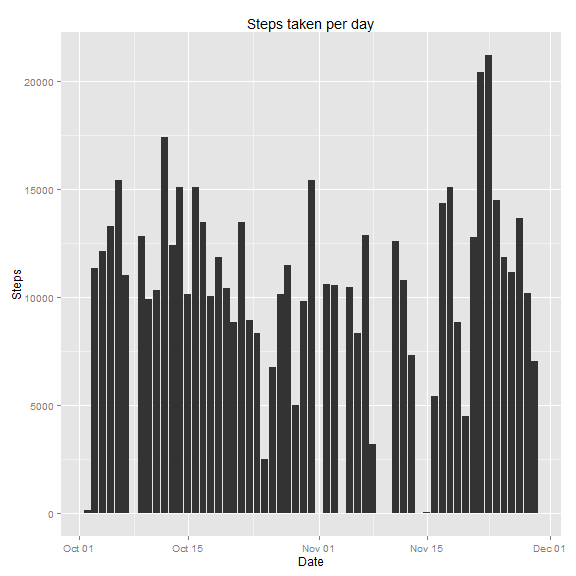
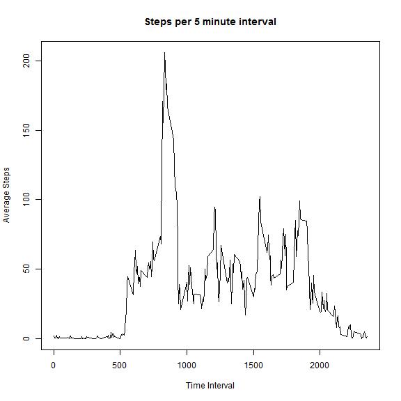
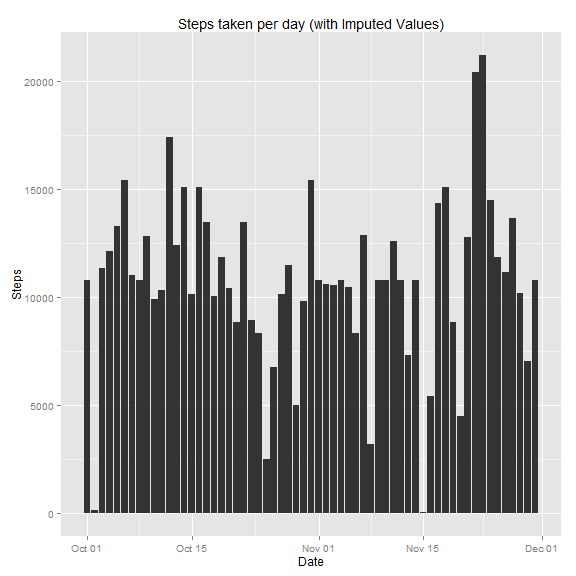
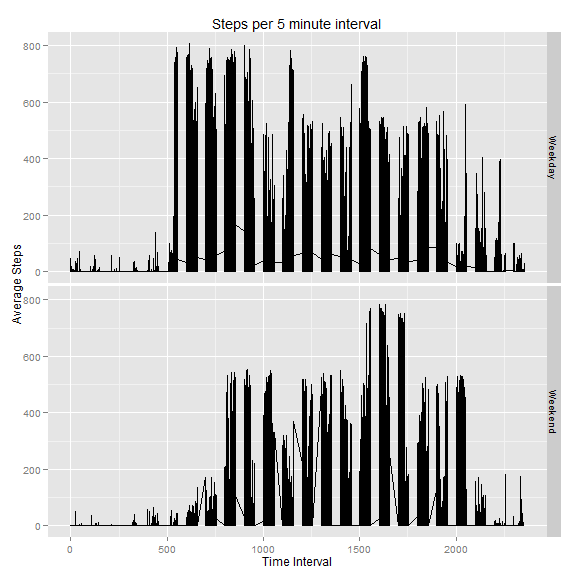

# Reproducible Research: Peer Assessment 1
=========================================
This version of the PA1_template was written by **Jacob Spangler**.

## Download and unzip the dataset

```r
#The raw data should be stored in Github with this script. If it isn't then this portion will 
#download the file and then unzip it.
if(!file.exists("activity.zip")){
  #Identify the location of the datafile
  fileURL <- "https://d396qusza40orc.cloudfront.net/repdata%2Fdata%2Factivity.zip"
  download.file(fileURL, "activity.zip", mode="wb")
  dateDownloaded <- date()
  print(dateDownloaded)
  
  #Unzip the data
  unzip("activity.zip")
}else{
  unzip("activity.zip")
}
```

## Loading and preprocessing the data

```r
#Read in the data
Activity_Data <- read.csv("activity.csv")

#Format the Dates
Activity_Data$date <- as.Date(Activity_Data$date, "%Y-%m-%d")

#Format the interval to 24 hr time clock
Activity_Data$time <- ifelse(nchar(Activity_Data$interval) == 1,
                             paste(000, Activity_Data$interval, sep=""),
                             Activity_Data$interval)
Activity_Data$time <- ifelse(nchar(Activity_Data$time) == 2,
                             paste(00, Activity_Data$time, sep=""),
                             Activity_Data$time)
Activity_Data$time <- ifelse(nchar(Activity_Data$time) == 3,
                             paste(0, Activity_Data$time, sep=""),
                             Activity_Data$time)

#Complete the date and interval formatting
Activity_Data$Date_Time <- as.POSIXct(paste(Activity_Data$date, Activity_Data$time),
                                      format="%Y-%m-%d %H%M")
```

## What is mean total number of steps taken per day?

```r
library(ggplot2)

ggplot(Activity_Data) +
  geom_histogram(aes(x=date, y=steps),  stat="identity") +
  ylab("Steps") +
  xlab("Date") +
  ggtitle("Steps taken per day")
```

```
## Warning: Removed 2304 rows containing missing values (position_stack).
```

 

### What is the average number of steps per day?

```r
tapply(Activity_Data$steps, Activity_Data$date, mean, na.omit=TRUE)
```

```
## 2012-10-01 2012-10-02 2012-10-03 2012-10-04 2012-10-05 2012-10-06 
##         NA     0.4375    39.4167    42.0694    46.1597    53.5417 
## 2012-10-07 2012-10-08 2012-10-09 2012-10-10 2012-10-11 2012-10-12 
##    38.2465         NA    44.4826    34.3750    35.7778    60.3542 
## 2012-10-13 2012-10-14 2012-10-15 2012-10-16 2012-10-17 2012-10-18 
##    43.1458    52.4236    35.2049    52.3750    46.7083    34.9167 
## 2012-10-19 2012-10-20 2012-10-21 2012-10-22 2012-10-23 2012-10-24 
##    41.0729    36.0938    30.6285    46.7361    30.9653    29.0104 
## 2012-10-25 2012-10-26 2012-10-27 2012-10-28 2012-10-29 2012-10-30 
##     8.6528    23.5347    35.1354    39.7847    17.4236    34.0938 
## 2012-10-31 2012-11-01 2012-11-02 2012-11-03 2012-11-04 2012-11-05 
##    53.5208         NA    36.8056    36.7049         NA    36.2465 
## 2012-11-06 2012-11-07 2012-11-08 2012-11-09 2012-11-10 2012-11-11 
##    28.9375    44.7326    11.1771         NA         NA    43.7778 
## 2012-11-12 2012-11-13 2012-11-14 2012-11-15 2012-11-16 2012-11-17 
##    37.3785    25.4722         NA     0.1424    18.8924    49.7882 
## 2012-11-18 2012-11-19 2012-11-20 2012-11-21 2012-11-22 2012-11-23 
##    52.4653    30.6979    15.5278    44.3993    70.9271    73.5903 
## 2012-11-24 2012-11-25 2012-11-26 2012-11-27 2012-11-28 2012-11-29 
##    50.2708    41.0903    38.7569    47.3819    35.3576    24.4688 
## 2012-11-30 
##         NA
```

### What is the median number of steps per day?

```r
tapply(Activity_Data$steps, Activity_Data$date, median, na.rm=TRUE)
```

```
## 2012-10-01 2012-10-02 2012-10-03 2012-10-04 2012-10-05 2012-10-06 
##         NA          0          0          0          0          0 
## 2012-10-07 2012-10-08 2012-10-09 2012-10-10 2012-10-11 2012-10-12 
##          0         NA          0          0          0          0 
## 2012-10-13 2012-10-14 2012-10-15 2012-10-16 2012-10-17 2012-10-18 
##          0          0          0          0          0          0 
## 2012-10-19 2012-10-20 2012-10-21 2012-10-22 2012-10-23 2012-10-24 
##          0          0          0          0          0          0 
## 2012-10-25 2012-10-26 2012-10-27 2012-10-28 2012-10-29 2012-10-30 
##          0          0          0          0          0          0 
## 2012-10-31 2012-11-01 2012-11-02 2012-11-03 2012-11-04 2012-11-05 
##          0         NA          0          0         NA          0 
## 2012-11-06 2012-11-07 2012-11-08 2012-11-09 2012-11-10 2012-11-11 
##          0          0          0         NA         NA          0 
## 2012-11-12 2012-11-13 2012-11-14 2012-11-15 2012-11-16 2012-11-17 
##          0          0         NA          0          0          0 
## 2012-11-18 2012-11-19 2012-11-20 2012-11-21 2012-11-22 2012-11-23 
##          0          0          0          0          0          0 
## 2012-11-24 2012-11-25 2012-11-26 2012-11-27 2012-11-28 2012-11-29 
##          0          0          0          0          0          0 
## 2012-11-30 
##         NA
```

## What is the average daily activity pattern?

```r
Removed_NAs <- na.omit(Activity_Data)
Avg_By_Interval <- as.data.frame(tapply(Removed_NAs$steps, Removed_NAs$time, mean))
colnames(Avg_By_Interval) <- "Average"
Avg_By_Interval$Interval <- rownames(Avg_By_Interval)

plot(Avg_By_Interval$Interval, Avg_By_Interval$Average, type="l",
     ylab="Average Steps", xlab="Time Interval", main="Steps per 5 minute interval")
```

 

```r
High_Int <- Avg_By_Interval$Interval[Avg_By_Interval$Average==max(Avg_By_Interval$Average)]
```
The 5-minute interval with the highest average number of steps is **0835**.

## Imputing missing values

```r
Missing_value_Count <- length(Activity_Data$steps[is.na(Activity_Data$steps)])
```
The number of missing values in the activities dataset is **2304**.

This code will fill in the missing values using the average number of steps for the given interval

```r
Activity_Data$Imputed_Data <- Activity_Data$steps

for(i in 1:nrow(Activity_Data)){
  if(is.na(Activity_Data$Imputed_Data[i])){
    Values_Interval <- Activity_Data$time[i]
    Activity_Data$Imputed_Data[i] <- as.numeric(Avg_By_Interval$Average[Avg_By_Interval$Interval==Values_Interval])
  }else{
    Activity_Data$Imputed_Data[i] <- Activity_Data$Imputed_Data[i]
  }
}
```

This will create a histogram using the imputed values.

```r
library(ggplot2)

ggplot(Activity_Data) +
  geom_histogram(aes(x=date, y=Imputed_Data),  stat="identity") +
  ylab("Steps") +
  xlab("Date") +
  ggtitle("Steps taken per day (with Imputed Values)")
```

 

### What is the average number of steps per day (with Imputed Values)?

```r
tapply(Activity_Data$Imputed_Data, Activity_Data$date, mean, na.omit=TRUE)
```

```
## 2012-10-01 2012-10-02 2012-10-03 2012-10-04 2012-10-05 2012-10-06 
##    37.3826     0.4375    39.4167    42.0694    46.1597    53.5417 
## 2012-10-07 2012-10-08 2012-10-09 2012-10-10 2012-10-11 2012-10-12 
##    38.2465    37.3826    44.4826    34.3750    35.7778    60.3542 
## 2012-10-13 2012-10-14 2012-10-15 2012-10-16 2012-10-17 2012-10-18 
##    43.1458    52.4236    35.2049    52.3750    46.7083    34.9167 
## 2012-10-19 2012-10-20 2012-10-21 2012-10-22 2012-10-23 2012-10-24 
##    41.0729    36.0938    30.6285    46.7361    30.9653    29.0104 
## 2012-10-25 2012-10-26 2012-10-27 2012-10-28 2012-10-29 2012-10-30 
##     8.6528    23.5347    35.1354    39.7847    17.4236    34.0938 
## 2012-10-31 2012-11-01 2012-11-02 2012-11-03 2012-11-04 2012-11-05 
##    53.5208    37.3826    36.8056    36.7049    37.3826    36.2465 
## 2012-11-06 2012-11-07 2012-11-08 2012-11-09 2012-11-10 2012-11-11 
##    28.9375    44.7326    11.1771    37.3826    37.3826    43.7778 
## 2012-11-12 2012-11-13 2012-11-14 2012-11-15 2012-11-16 2012-11-17 
##    37.3785    25.4722    37.3826     0.1424    18.8924    49.7882 
## 2012-11-18 2012-11-19 2012-11-20 2012-11-21 2012-11-22 2012-11-23 
##    52.4653    30.6979    15.5278    44.3993    70.9271    73.5903 
## 2012-11-24 2012-11-25 2012-11-26 2012-11-27 2012-11-28 2012-11-29 
##    50.2708    41.0903    38.7569    47.3819    35.3576    24.4688 
## 2012-11-30 
##    37.3826
```

### What is the median number of steps per day (with Imputed Values)?

```r
tapply(Activity_Data$Imputed_Data, Activity_Data$date, median, na.rm=TRUE)
```

```
## 2012-10-01 2012-10-02 2012-10-03 2012-10-04 2012-10-05 2012-10-06 
##      34.11       0.00       0.00       0.00       0.00       0.00 
## 2012-10-07 2012-10-08 2012-10-09 2012-10-10 2012-10-11 2012-10-12 
##       0.00      34.11       0.00       0.00       0.00       0.00 
## 2012-10-13 2012-10-14 2012-10-15 2012-10-16 2012-10-17 2012-10-18 
##       0.00       0.00       0.00       0.00       0.00       0.00 
## 2012-10-19 2012-10-20 2012-10-21 2012-10-22 2012-10-23 2012-10-24 
##       0.00       0.00       0.00       0.00       0.00       0.00 
## 2012-10-25 2012-10-26 2012-10-27 2012-10-28 2012-10-29 2012-10-30 
##       0.00       0.00       0.00       0.00       0.00       0.00 
## 2012-10-31 2012-11-01 2012-11-02 2012-11-03 2012-11-04 2012-11-05 
##       0.00      34.11       0.00       0.00      34.11       0.00 
## 2012-11-06 2012-11-07 2012-11-08 2012-11-09 2012-11-10 2012-11-11 
##       0.00       0.00       0.00      34.11      34.11       0.00 
## 2012-11-12 2012-11-13 2012-11-14 2012-11-15 2012-11-16 2012-11-17 
##       0.00       0.00      34.11       0.00       0.00       0.00 
## 2012-11-18 2012-11-19 2012-11-20 2012-11-21 2012-11-22 2012-11-23 
##       0.00       0.00       0.00       0.00       0.00       0.00 
## 2012-11-24 2012-11-25 2012-11-26 2012-11-27 2012-11-28 2012-11-29 
##       0.00       0.00       0.00       0.00       0.00       0.00 
## 2012-11-30 
##      34.11
```

## Are there differences in activity patterns between weekdays and weekends?

```r
Activity_Data$Day_of_Week <- weekdays(Activity_Data$date)
Activity_Data$Category <- "Weekday"
Activity_Data$Category[Activity_Data$Day_of_Week=="Sunday"] <- "Weekend"
Activity_Data$Category[Activity_Data$Day_of_Week=="Saturday"] <- "Weekend"
Activity_Data$Category <- factor(Activity_Data$Category, levels=c("Weekday", "Weekend"))

ggplot(Activity_Data, aes(x=interval, y=Imputed_Data)) +
  geom_line() +
  facet_grid(Category~.) +
  xlab("Time Interval") +
  ylab("Average Steps") +
  ggtitle("Steps per 5 minute interval")
```

 

